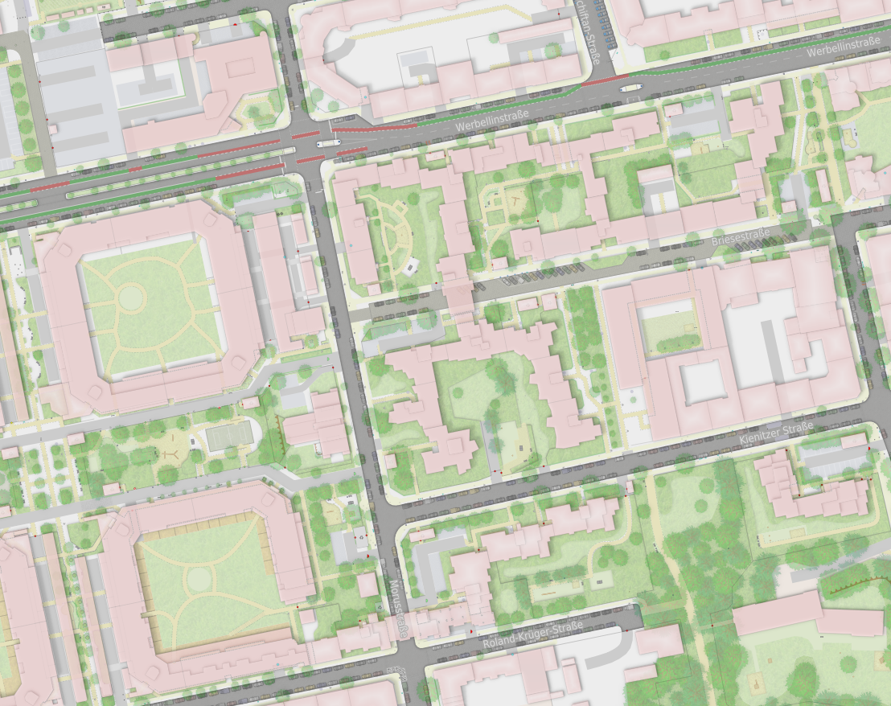

# Straßenraumkarte (Street Space Map)

The _Straßenraumkarte_ is a map style with a particular focus on the spatial organisation of urban and street space — especially carriageways and objects in the public realm, as well as urban land use. It was developed as a basemap for OpenStreetMap projects in Berlin-Neukölln, but can now be generated for other places as well.

The appeal of the style, which is aesthetically inspired by architectural plans, lies in its detailed depiction of urban environments. It emphasises carriageway surfaces, street furniture, buildings, land-use detail, and parked cars in the street space. Where these features are to be shown for a place, they often first need to be mapped in OpenStreetMap — which can be a labour-intensive process.

Technically, the style combines a QGIS project (with the layer styling) and an involved data pipeline based on osm2pgsql and SQL post-processing that prepares geometries and attributes for rendering.

Note: This repository is a new, modernised version based on an osm2pgsql / SQL / QGIS workflow; the original version (Overpass / Python / QGIS) lives at [osmberlin/strassenraumkarte-neukoelln](https://github.com/osmberlin/strassenraumkarte-neukoelln).



## Requirements

The following tools are required to run the data pipeline and tile rendering (package names may vary by distribution):

| Component | Purpose |
| --- | --- |
| **PostgreSQL** + client (`psql`) | Database server and CLI |
| **PostGIS** | Spatial types/functions used by import and SQL processing |
| **osm2pgsql** | OSM import into PostGIS |
| **osmium-tool** (`osmium`) | Optional bbox extracts from a PBF |
| **QGIS** (PyQGIS / Python bindings) | Render XYZ tiles from `style/strassenraumkarte.qgz` via a custom metatile loop |
| **Martin** (optional) | Serve PostGIS tables as MVT vector tiles for the MapLibre preview |

Optional for interactive styling: open `style/strassenraumkarte.qgz` in the QGIS GUI (same database connection as below).

Default connection and project CRS (override with environment variables or CLI flags):

| Variable | Default | Meaning |
| --- | --- | --- |
| `DB_NAME` | `strassenraumkarte` | PostgreSQL database |
| `DB_USER` | `postgres` | Database user |
| `DB_HOST` | `localhost` | Database host |
| `DB_PORT` | `5433` | Database port |
| `CRS` | `3857` | Project CRS (EPSG code) for osm2pgsql import / PostGIS storage |

Credentials are normally provided via [`~/.pgpass`](https://www.postgresql.org/docs/current/libpq-pgpass.html), for example:

```text
localhost:5433:*:postgres:YOUR_PASSWORD
```

Shared defaults live in `data/db_config.sh`.

## Setup

1. **Make sure** the tools listed under Requirements are installed.
2. **Start PostgreSQL** and ensure you can connect with the defaults above (or set `DB_*` / `PGPASSFILE`).
3. **Create the database and enable PostGIS** (helper):

   ```bash
   ./run.sh --setup-db
   ```

   Equivalent manual steps:

   ```bash
   createdb -h localhost -p 5433 -U postgres strassenraumkarte
   psql -h localhost -p 5433 -U postgres -d strassenraumkarte -c "CREATE EXTENSION postgis;"
   ```

4. **Verify** tools and database:

   ```bash
   ./run.sh --check
   ```

5. **QGIS project:** `style/strassenraumkarte.qgz` must point at the same host/port/database and use EPSG:3857 (same as `CRS` / `--crs`, unless you intentionally diverge — see [Rendering + CRS](#rendering--crs)). For headless rendering, authentication uses `~/.pgpass` and `PGUSER` (from `DB_USER` in `data/db_config.sh`) — the project datasources typically omit the username.

Tile rendering uses a custom **PyQGIS metatile loop** ([`render/xyz_tiles.py`](render/xyz_tiles.py)), not `qgis_process`. Progress is reported after each metatile; the default tile background is `#ededed` (override with `--background`). Each metatile is rendered with a **gutter** of extra surrounding tiles (default 1) so labels and symbols can cross metatile edges; gutter pixels are discarded and only core tiles are written. Rendering is direct Web Mercator; ground-metre widths use `@mercator_scale`.

`run.sh` also runs these checks before a full pipeline and can create the DB with `--setup-db` in the same invocation.

## Usage

### Full pipeline (process + render)

From the repository root, `run.sh` runs data preparation and then XYZ tile rendering. `--data` is required (Geofabrik URL or local `.osm.pbf`). `--bbox` is optional (`xmin,ymin,xmax,ymax` in WGS84); without it, the full PBF is imported and tiles cover the combined data extent.

```bash
# Map for a specific extent from fresh OSM data (example: ~4×5 km in Berlin-Neukölln)
./run.sh \
  --bbox 13.3924,52.4543,13.4859,52.5009 \
  --data https://download.geofabrik.de/europe/germany/berlin-latest.osm.pbf

# An extent from a local OSM pbf file, without z20 (example: small area around Richardplatz, Berlin)
./run.sh \
  --bbox 13.439498,52.472155,13.449776,52.475932 \
  --data data/osm/berlin-latest.osm.pbf \
  --zmax 19

# Map for a full, fresh OSM extract (example: all of Berlin)
./run.sh --data https://download.geofabrik.de/europe/germany/berlin-latest.osm.pbf
```

Useful options:

| Option | Meaning |
| --- | --- |
| `--setup-db` | Create database + enable PostGIS if missing |
| `--check` | Only verify tools and database connectivity |
| `--crs` | Project CRS as EPSG code (default: `3857`; normally leave unchanged — see [Rendering + CRS](#rendering--crs)) |
| `--refresh` | Drop and recreate the database schema before import |
| `--skip-processing` | Import only (skip SQL processing) |
| `--skip-render` | Stop after data preparation |
| `--project` | QGIS project (default: `style/strassenraumkarte.qgz`) |
| `--out` | Validated tile generation directory (default: `render/tiles-validated`; legacy `render/tiles` is preserved) |
| `--zmin` / `--zmax` | Zoom range for rendering (defaults: 15 / 20) |
| `--metatile` | Metatile core size (default: 8) |
| `--gutter` | Extra tiles around each metatile for seamless labels/symbols; rendered then discarded (default: 1) |
| `--dpi` | Render DPI (default: 96) |
| `--background` | Tile background colour as `#rrggbb` (default: `#ededed`) |
| `--format` | Tile format `png` or `jpg` (default: `jpg`) |
| `--advanced-effects` | Enable QGIS shadows/glows for reference-image renders; normal tiles disable every project effect in a disposable render copy |
| `--resume` | Resume only metatiles with a matching manifest, a commit record, and decodable 256×256 tiles |
| `--preflight` | Validate QGIS providers, all visible layers, project identity, and style raster decoding without rendering |

Tiles are written as XYZ files under `render/tiles-validated/{z}/{x}/{y}.{png|jpg}`. Each generation has a manifest and append-only completion records. Use a new `--out` directory for a changed style, dataset, or render setting.

### Street-parking generation

Parking is calculated independently from the derived `lanes` table. The
production command imports original OSM tags and way-node order into an
isolated generation schema, performs metre operations in EPSG:25833, and
writes the file-backed layer used by the QGIS project:

```bash
./data/build_parking.sh --data data/osm/berlin-latest.osm.pbf
./data/build_parking.sh --data data/osm/berlin-latest.osm.pbf --bbox 13.439498,52.472155,13.449776,52.475932
./data/build_parking.sh --data data/osm/berlin-latest.osm.pbf --resume GENERATION_ID
./data/build_parking.sh --publish GENERATION_ID
```

Each generation stores its manifest, diagnostics, source tables, parking lines,
and points under `data/parking/`. Publication keeps the prior GeoJSON in
`data/parking/rollback/`; see [`docs/PARKING_RULE_CHECKLIST.md`](docs/PARKING_RULE_CHECKLIST.md)
for the pinned upstream revision and rule mapping.

### Interactive preview

Serve the tile directory with a small local server that also lists PBFs under `data/osm` and can start `./run.sh` from the map UI (draw a BBOX, pick a local PBF or Geofabrik URL):

```bash
./render/preview_server.py
# open http://127.0.0.1:8000/preview.html
```

The preview page can optionally show classic OSM tiles underneath the Straßenraumkarte and includes a metatile/gutter debug overlay. For tiles-only viewing without the run API, `cd render/tiles && python3 -m http.server 8000` still works.

### MapLibre vector-tile preview

The in-progress MapLibre port reads MVT vector tiles directly from PostGIS; its style contains no raster tile source. Start Martin and the static preview in separate terminals:

```bash
./render/serve_mvt.sh
python3 -m http.server 8080 --directory web
# open http://127.0.0.1:8080/
```

Parked cars come from the street-parking pipeline (`data/build_parking.sh`); load its GeoJSON into PostGIS once with `./data/load_parking_cars.sh` before starting Martin.

The port is a verified subset, not yet a 1:1 replacement for all enabled QGIS layers. Run the QGIS-derived parity guard after style or tile-schema changes:

```bash
python3 scripts/audit_maplibre_parity.py
python3 scripts/audit_road_markings.py
python3 scripts/audit_surface_textures.py
```

The audits check direct QGIS symbol colors/effects separately, categorized property names, transparent fallbacks, labels/halos, ground-unit sizes, every MapLibre `get` against the Martin schema, all live road-marking combinations (including exact SQL-derived sharks-teeth geometry and bridge/tunnel strata), and all live road-surface texture rotations at every z14-z20 boundary. Use `python3 scripts/audit_maplibre_parity.py --require-full-parity` for the intentionally failing whole-project gate. See [MapLibre parity status](docs/MAPLIBRE_PARITY.md) for the exact boundary and remaining work.

### Feature-class colour comparison

`scripts/compare_feature_classes.py` measures CIE76 ΔE between the median
colour of QGIS, MapLibre, and (when supplied) the published original tiles for
each source-table/class pair. It samples polygon interiors, line centrelines,
and point positions across identical 3×3-tile blocks. ΔE of about 2.3 is the
smallest difference most people can see. It measures colour and presence, not
the size or shape of symbols and line work.

The current six-block check covers z15–z18, three Berlin areas, 161 classes,
and 3.23 million sampled pixels. The pixel-weighted mean ΔE between MapLibre
and QGIS is **1.53** (2.03 before the work listed below; against the original
tiles 1.94, was 2.20); 70 % of the sampled pixels belong to classes at or below
ΔE 2.3, and 8 classes with at least 500 sampled pixels are above ΔE 5 (19
before; two of them are the sports pitches on grass, which deliberately
follow the original tiles, ΔE 0.4 to them). Repeated runs of one commit differ
by about 0.001 in the mean within a session and 0.03 across sessions, so compare
changes with a same-session A/B (`scripts/parity_check.py`, below). QGIS paint
effects (building shadows, road edge shade, forest/scrub glow) are approximated
with blurred lines; see `docs/MAPLIBRE_PARITY.md`. The material changes:

| Class | ΔE before → after | Change |
| --- | --- | --- |
| residential road, concrete | 12.4 → 3.1 | QGIS composites road textures with Multiply; MapLibre now uses darken-only sprites. |
| secondary road, concrete; pedestrian concrete / plates; sett and paving classes | 1.6–7.7 → 0.0–2.3 | Same. |
| steps | 12.0 → 0.8 (A/B) | Footway fill and casing under the hash; QGIS stroke width, colour and length. |
| barred-area markings | 7.2 → 0.5 | The stripe/crosshatch fill is now drawn. |
| tree crowns | 4.7 → 0.7 | Crown opacity × 0.7, from a grid search; lifts every class drawn under trees. |
| red cycle lanes | 7.4 → 0.4 | Sidepath cycleways are grey in QGIS, not lilac (QGIS draws every matching rule; the lilac footway rule excludes sidepaths). |
| cycleway | 5.9 → 3.7 | Same. |
| bridge | 14.5 → 1.3 | QGIS's deck colour, and the deck drawn below paths and rails as in QGIS's layer groups. |
| retaining wall | 10.8 → 4.5 | Wall triangles without fill antialiasing (they carried nearly all the error), tree crowns. |
| manhole | 4.9 → 1.4 | QGIS's 0.75 m icon size (was 1.6 m); other icon sizes and the bent-mast lamp rotation also follow QGIS now. |
| landuse parking, landuse greenery | 3.3 → 3.0, 4.3 → 2.3 (greenery: tree crowns and textures) | QGIS overlays textures on landuse polygons with a `surface` tag. |
| soccer pitches, asphalt / paved | 6.6 → 0.7 / 0.0 | QGIS colours pitches per surface (grey for asphalt/paved/concrete, sand yellow); the style had one colour. |
| landscape embankment, platform line | 8.7 → 5.1, 8.0 → 5.7 | Calibrated opacities (see below). |
| grass, recreation ground, meadow | 2.9 / 2.7 / 4.1 → 0.4 / 0.5 / 0.5 | One landuse texture per pixel: MapLibre stacked the textures of overlapping polygons (88 % of grass lies inside parks); QGIS draws fill and texture per feature, so only the topmost texture shows. |
| forest, wood | 2.7 / 1.9 → 2.2 / 2.1 | Tree-crown factor re-tuned to 0.9 after the texture fix (it had compensated for the doubled texture). |
| street lamp | 5.1 → 3.7 | The 85,000 lamps (and cabinets, vending machines, signs ... 26 symbols) are drawn now; most are sub-pixel to 1.6 m, so the class table barely sees them. |

Thin-line classes (retaining walls, kerbs, fences) are sensitive to the capture
environment: the same commit read about one ΔE lower in another browser setup, so
treat differences below roughly 1 ΔE on those classes as noise.

The largest remaining colour gaps (classes with at least 500 sampled pixels):

| Class | ΔE MapLibre–QGIS | ΔE QGIS–original | Reading |
| --- | --- | --- | --- |
| sports pitches on grass | 19 | 19 | Decided: follow the original (ΔE 0.4 to it). |
| street cabinet, waste basket | 5.7, 5.3 | Sub-pixel markers: identical at z19; at the sampled zooms QGIS draws a soft smear, MapLibre a crisp sprite. |
| cycleway | 6.3 | Mostly street-tree crowns on top: the crown factor trades street trees and cycleways (lighter is better) against forests (stronger is better); 0.9 balances the mean. |
| sidewalk, landuse parking | 3.4, 3.1 | QGIS's building drop shadows: against a QGIS render without effects they are 1.1 and 2.5 (exact on the z18 block). Effects are not approximated (decided). |

QGIS effects (building drop shadows, scrub width shade, road inner shadows, water depth
gradient) are deliberately not approximated: buildings (the largest class by pixels, ΔE 2.9)
match the original tiles, which lack the shadow. Not ported: landscape peaks, the dog-park paw
pattern (invisible under the canopy in the measured blocks), the flagpole glyph, and the
polygon/way layers' scale-limited symbols. Line and icon geometry is checked on z19
side-by-side renders, not by these colour numbers.

`./scripts/parity_check.py --tag NAME [--baseline render/parity-runs/OLD/classes.csv]` repeats
the whole measurement in about two minutes (reference tiles are cached in
`render/parity-reference/`, git-ignored). It captures the six blocks, runs the comparison and
prints the mean ΔE to QGIS and to the original, the classes above 5 and the classes that moved
against a baseline; `--paint`, `--hide` and `--zooms 19` try ideas without editing the style.
The manual procedure behind it:

To repeat the measurement, make a MapLibre capture of every block with
`node scripts/capture_maplibre_block.js Z X0 Y0 3 3 out.png` and a QGIS render
of the same block with `render_tiles.sh --format png`. List the blocks in a
JSON file (`original` is optional and is a directory of the published tiles):

```json
[{"z": 17, "x0": 70425, "y0": 43010,
  "qgis": "qgis-tiles", "maplibre": "capture-17.png", "original": "original-tiles"}]
```

then run:

```bash
./scripts/compare_feature_classes.py blocks.json --csv feature-classes.csv
```

### Data preparation only

```bash
./data/data_preparation.sh \
  --data https://download.geofabrik.de/europe/germany/berlin-latest.osm.pbf \
  --bbox 13.3924,52.4543,13.4859,52.5009 \
  --refresh

# Existing local PBF, full file (no bbox extract)
./data/data_preparation.sh --data osm/berlin-latest.osm.pbf --refresh
```

`osm_import.lua` reads the CRS from the `CRS` environment variable (set by `db_config.sh` / `--crs`).

### Rendering only

```bash
./render/render_tiles.sh \
  --bbox 13.3924,52.4543,13.4859,52.5009 \
  --metatile 8 \
  --gutter 1 \
  --background '#ededed'

# Without --bbox: render the combined PostGIS / project extent
./render/render_tiles.sh --zmin 16 --zmax 19
```

Before a large run, use `./render/render_tiles.sh --preflight`. Audit legacy tiles without changing them with `python3 render/audit_tiles.py render/tiles --report render/legacy-tile-audit.json`. For a controlled dense-tree comparison, run `./render/benchmark_tiles.sh 17:70344:43000`; it produces independent full/effects/tree-isolation generations and a JSON summary.

### Rendering + CRS

**CRS:** EPSG:3857 (Web Mercator) is the standard throughout the pipeline — osm2pgsql import, PostGIS storage, QGIS project, and tile rendering. It should normally **not** be changed. If you do override `--crs` / `CRS`, you must also adapt the QGIS project CRS and **all** layer CRS / projection references. Changing the env/CLI value alone does **not** rewrite `style/strassenraumkarte.qgz` or existing layer definitions in this *.qgz-File.

Under EPSG:3857, SQL processing converts ground metres to map units with an automatic scale factor \(1/\cos\varphi\) derived from the data extent centroid (or `--bbox` mid-latitude). See `data/processing/sql/crs_scale.sql` and `metres()`. For a metric projected CRS (e.g. UTM), the factor is 1.

QGIS styles store ground-metre symbol sizes as **map units** scaled by `@mercator_scale` (same factor). Headless rendering ([`render/xyz_tiles.py`](render/xyz_tiles.py)) sets that project variable from the render extent and draws tiles **directly in EPSG:3857**. In the QGIS GUI, a project macro (`openProject`) sets `@mercator_scale` once from the map canvas centre — enable Python macros under *Settings → Options → General* (or allow when opening the project). Without macros, set the project variable `mercator_scale` manually (≈ \(1/\cos\varphi\); e.g. Berlin ≈ 1.64).

## Further information about the map (in German)

- Beitrag in den *Kartographischen Nachrichten* / Info und Praxis 3/2022: „Die Neuköllner Straßenraumkarte – Ein detaillierter Plan des öffentlichen Raumes auf Basis freier OpenStreetMap-Geodaten“ (ab Seite 5 / A-10) — [PDF](https://static-content.springer.com/esm/art%3A10.1007%2Fs42489-022-00119-1/MediaObjects/42489_2022_119_MOESM1_ESM.pdf)
- Lightning Talk auf der FOSSGIS-Konferenz 2022 (5 Minuten): „Die Neuköllner Straßenraumkarte – ein hochaufgelöster OSM-Mikro-Mapping-Kartenstil“ — [Recording](https://media.ccc.de/v/fossgis2022-14180-die-neukllner-straenraumkarte-ein-hochaufgelster-osm-mikro-mapping-kartenstil)
